  

  

 

# 01 // WELCOME

> **"Designing systems people do not notice — only experiences they remember."**

I write backend architectures for intelligence and interfaces that feel alive. Where deep engineering meets cinematic movement. I build software where machine intelligence, robust backend systems, and high-fidelity interaction work together as a single, fluid product surface.

 

  

 

# 02 // TARGET PARAMETERS

I build for teams and products that require:
* **Production-Grade Intelligence**: Implementing AI agents and neural models with strict guardrails, reliable evaluation pipelines, and robust memory management rather than basic prompt wrappers.
* **Low-Latency Architecture**: Designing real-time synchronization flows, WebRTC stream management, and high-frequency communication protocols built for speed and stability.
* **Immersive Visual Logic**: Shaping frontend interfaces that communicate state change through intentional micro-interactions, scroll-bound shaders, and optimized rendering pipelines.

 

  

 

# 03 // CORE LAWS

* **Performance is empathy.** Latency is the physical friction of software. A fast interface respects the person behind the screen and values their time.
* **Good architecture is invisible.** A system should remain clean and predictable from the outside, hiding complex orchestrations behind self-documenting interfaces.
* **Interaction must explain.** Motion is not decoration. It is a visual vector that guides user focus, explains state transitions, and makes complex systems legible.
* **Abstractions must pay for themselves.** Every extra layer of system complexity should make a codebase easier to debug and scale, never harder to reason about.

 

  

 

# 04 // ACTIVE TRANSMISSION

* **BUILDING** // Next-generation orbital intelligence engines ([Spectravein](https://spectravein.vercel.app)) and encrypted communication nodes ([SecureChat](https://securechat18.app)).
* **RESEARCHING** // Multi-agent model cascades, memory strategies, and automated E2E model evaluation workflows.
* **OPTIMIZING** // Offline-first client synchronizations, WebGL shader execution curves, and client-side database caching.
* **EXPLORING** // Distributed state networks, real-time voice assessment pipelines, and canvas choreography.

 

  

 

# 05 // SYSTEM TOOLCHAIN

| DOMAIN | ACTIVE TOOLCHAIN |
| :--- | :--- |
| **AI Engineering** | Large Language Models (LLMs), Agentic Frameworks, RAG, Prompt Pipelines, Model Evaluation |
| **Machine Learning** | Python, PyTorch, scikit-learn, Data Pipelines |
| **Backend Systems** | Node.js, TypeScript, Python, FastAPI, Django, WebSockets, WebRTC, REST |
| **Data Layer** | PostgreSQL, MongoDB, Redis, IndexedDB, Vector Search |
| **Interfaces & Motion** | React, Next.js, Tailwind CSS, Three.js, React Three Fiber, GSAP, Framer Motion |
| **Architecture** | Real-time Systems, Distributed State, API Design, Latency Optimization |
| **Engineering Practice** | Git, Docker, Playwright, Vitest, CI/CD, Observability & Telemetry |

 

  

 

# 06 // LIVE SYSTEM STATUS

<table width="100%" style="border-collapse: collapse; border: none;">
  <tr style="border: none;">
    <td width="50%" align="center" style="border: none; background: transparent;">
      
    </td>
    <td width="50%" align="center" style="border: none; background: transparent;">
      
    </td>
  </tr>
</table>

 

  

 

# 07 // CONNECT

  

<table width="100%" style="border-collapse: collapse; border: none; font-family: monospace;">
  <tr style="border: none;">
    <td align="center" style="border: none; padding: 10px;">
      <a href="https://www.harshavardhan-k.me/" style="color: #00f2fe; text-decoration: none; font-weight: bold; letter-spacing: 1px;">// PORTFOLIO</a>
    </td>
    <td align="center" style="border: none; padding: 10px;">
      <a href="https://www.linkedin.com/in/harshavardhan-20-k/" style="color: #5e6ad2; text-decoration: none; font-weight: bold; letter-spacing: 1px;">// LINKEDIN</a>
    </td>
    <td align="center" style="border: none; padding: 10px;">
      <a href="mailto:harshavardhan3259@gmail.com" style="color: #10b981; text-decoration: none; font-weight: bold; letter-spacing: 1px;">// EMAIL</a>
    </td>
    <td align="center" style="border: none; padding: 10px;">
      <a href="https://drive.google.com/file/d/1g_EyEwvtG9v5GpdyEqVUg9QedIlSW678/view?usp=sharing" style="color: #a1a1aa; text-decoration: none; font-weight: bold; letter-spacing: 1px;">// RESUME</a>
    </td>
  </tr>
</table>

 
 

   
  END TRANSMISSION // STATUS 200

