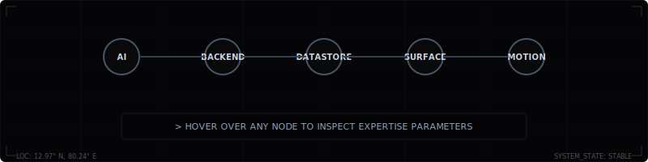
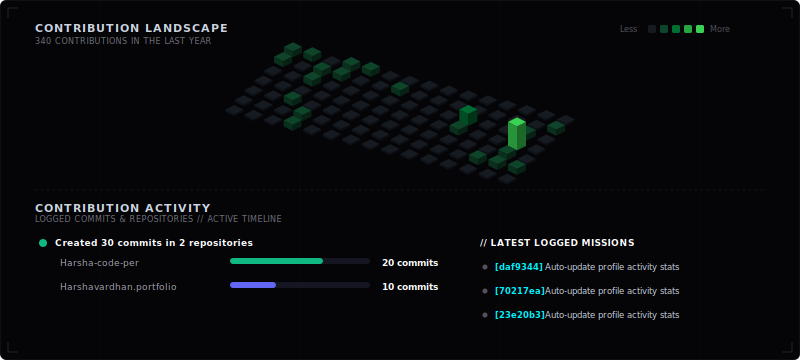

  

 

## Engineering Philosophy

I am an undergraduate focused on building software that integrates machine learning models, robust backend systems, and responsive user interfaces into complete products. Instead of isolating models in experimental notebooks, I believe in deploying them into production workflows that solve real-world problems.

My approach is grounded in learning by building. I believe clean code, structured APIs, and engineering discipline are just as critical to AI applications as the models themselves. I write code to explore how intelligent systems can be made robust, intuitive, and genuinely useful to people.

 

  

 

  

 

  

 

## Current Focus

*   **Billytics** // An AI-powered Business Operating System (BusinessOS) tailored for Indian SMBs, especially in Tier-2/3 cities. I am building Billytics as an offline-first, multilingual platform that integrates billing, UPI payments, and inventory management, using a conversational voice assistant (Billy AI) to help non-technical owners make data-driven decisions.
*   **SecureChat** // A secure real-time communication platform. Having established the initial MVP, I am focusing on scaling the system, optimizing WebSocket routing for lower latency, and implementing robust end-to-end encryption to guarantee data privacy.

 

  

 

## Technical Stack

A visual map of the languages, frameworks, and tools I use to build systems:

 

  

 

  

 

## Architectural Preferences &amp; Principles

*   **Offline-First &amp; Sync** // Designing local databases and synchronization layers that function in zero-connectivity areas and reconcile state seamlessly once online.
*   **Security &amp; Privacy** // Prioritizing end-to-end encryption, secure token routing, and sandboxed execution rather than delegating security to third-party endpoints.
*   **Production-Ready AI** // Structuring low-footprint, specialized inference engines that provide structured data output without system bloat.
*   **Simplicity &amp; Accessibility** // Designing lightweight user interfaces that are fast, intuitive, and accessible to users regardless of their technical background.

 

  

 

## GitHub Activity

 

  

 
 

   
  END TRANSMISSION // HANDSHAKE_RESOLVED

