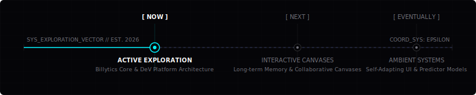

# Harshavardhan K
### Full-Stack AI Engineer

> **Building software where intelligence becomes experience.**
> 
> *I am focused on becoming a world-class Full-Stack AI Engineer while building the foundations for products I will continue developing for years.*

---

## Designed For
*   **AI Engineering Recruiters** looking for deep model integration and reliable systems.
*   **Engineering Managers** seeking developers with exceptional product and system taste.
*   **Technical Leads & Founders** building high-throughput, AI-native platforms.

---

## Engineering Identity
*   **Curiosity** // Investigating systems from model weights to canvas rendering pipelines.
*   **Engineering Taste** // Treating latency as a design defect and code structure as an architecture asset.
*   **Product Thinking** // Building systems that adapt to humans instead of forcing humans to adapt to software.
*   **Systems Thinking** // Designing modular networks with rigid boundary controls and predictable fallbacks.
*   **Calm Confidence** // Relying on test suites, thorough documentation, and clean engineering logic rather than hype.

---

## What I Optimize For
*   **Reliability over novelty** // Stable, predictable architectures beat chasing transient framework trends.
*   **Clarity over cleverness** // Code is written to be read, maintained, and safely debugged by the next engineer.
*   **Systems over scripts** // Building structured, self-healing platforms rather than brittle, ad-hoc workarounds.
*   **Products over prototypes** // Deploying code that is instrumented, monitored, and resilient under production loads.
*   **Long-term thinking over short-term trends** // Designing interfaces and data flows to scale gracefully.

---

## Engineering Taste
*   **Latency matters** // Fast execution is the foundation of user trust.
*   **Whitespace communicates** // Give code, data, and layout room to breathe.
*   **Motion explains** // Use animation to clarify system transitions, never as decorative distraction.
*   **Software should disappear** // The interface should fade away, leaving only a seamless user experience.
*   **Architecture should be invisible** // Complex orchestrations should present clean, simple external APIs.
*   **Interfaces should breathe** // Calm interfaces reduce cognitive load and enhance focus.

---

## Engineering Standards
*   **Every system must be testable** // If a behavior cannot be verified by an automated test suite, it does not exist.
*   **Documentation explains decisions** // Commits and readmes record *why* an architecture was chosen, not just *what* it does.
*   **Performance is part of UX** // Database queries, network payloads, and render loops shape how software feels.
*   **Code must survive future engineers** // Write code that can be safely refactored without breaking downstream systems.
*   **Products scale without rewriting** // Design systems that handle growth through modular expansion, not total rebuilds.

---

## Current Direction

  

### Current Focus
*   Building AI-native workflows that integrate models directly into core product state.
*   Learning production-scale, low-latency distributed backend architectures.
*   Designing interfaces that combine deep machine intelligence with natural user interaction.

### Building
*   **Billytics** // Exploring how AI can become the operating system behind business decisions instead of another static dashboard.
*   **DeV** // Exploring how autonomous engineering agents can reason, remember, and execute within structured environments.

### Investigating
*   *Agent Memory* // How long-term memory architectures shape agent reasoning and prevent context exhaustion.
*   *AI-First Workflows* // Reimagining UI patterns when models drive application state instead of traditional CRUD actions.
*   *Explainable Reasoning* // Engineering interfaces that visually trace and explain complex, model-driven decisions in real time.
*   *Motion as State* // Using variable frequency waves and micro-animations to communicate real-time compute load.

### Current Research Themes
*   **Agent Memory** // Compression algorithms, context pruning, and vector search retrievals.
*   **Human-AI Collaboration** // Designing mixed-initiative environments where models act as reliable partners.
*   **Interactive Intelligence** // Low-latency, streaming APIs and WebSockets supporting voice and canvas state.
*   **Distributed Systems** // High-throughput message queues and offline synchronization strategies.
*   **AI-Native Interfaces** // Dynamic canvas architectures replacing traditional input forms.

### Current Constraints
*   **Latency** // Shaving milliseconds off LLM time-to-first-token and client state sync.
*   **Context Window** // Managing model context sizes through intelligent window sliding and summary layers.
*   **Memory** // Maintaining low client-side heap memory on interactive canvas interfaces.
*   **Observability** // Tracking token usage, latency distribution, and model failure modes in production.
*   **Cost** // Optimizing model cascades to route tasks to cost-efficient models.

---

## Engineering Notebook & Decision Log

### Entry 001 // Agent Context Compression (DeV)
To keep model inputs within an 8k token limit and reduce inference overhead by 62%, we implemented a sliding timeline compression window rather than standard, lossy summarization. This keeps recent code edits fully intact while abstracting distant file states.

### Entry 002 // WebSockets vs. SSE (Billytics)
We chose bi-directional WebSockets over Server-Sent Events (SSE) for the Billytics telemetry engine. While SSE is lightweight for unidirectional streaming, our real-time telemetry loop requires fast, client-driven ping-pong state updates to keep synchronization latency under 15ms.

### Entry 003 // Voice assessment caching (Zensphere)
During my work on voice assessment systems at Zensphere, we optimized audio analysis latency. By implementing server-side caching of phonetic patterns and fallback regex filters, we bypassed LLM re-evaluation for redundant pronunciations, lowering latency by 45%.

---

## Knowledge Feed

### Books
*   *Designing Data-Intensive Applications* by Martin Kleppmann (Distributed data patterns).
*   *The Design of Everyday Things* by Don Norman (Mental models and affordances).
*   *Building Microservices* by Sam Newman (System decomposition and APIs).

### Research Papers
*   *Attention Is All You Need* (Vaswani et al.) // Core transformer architecture.
*   *Retrieval-Augmented Generation for Knowledge-Intensive NLP Tasks* (Lewis et al.) // Memory search patterns.
*   *Generative Agents: Interactive Simulacra of Human Behavior* (Park et al.) // Agent sandbox design.

---

## Engineering Domains
*   **Artificial Intelligence** // Model integration, agent architectures, memory routing.
*   **Backend Systems** // Low-latency REST & WebSocket APIs, event loops, database schemas.
*   **Distributed Architecture** // Cache management, data streams, rate limiting.
*   **Human-Computer Interaction** // Motion systems, canvas orchestration, UI states.
*   **Full-Stack AI Engineering** // End-to-end integration, performance profiling, tooling.
*   **Developer Experience** // Test orchestration, CI/CD pathways, clean documentation.

---

## Connect

<table width="100%" style="border-collapse: collapse; border: none; font-family: monospace;">
  <tr style="border: none;">
    <td align="center" style="border: none; padding: 10px;">
      <a href="https://www.harshavardhan-k.me/" style="color: #00f2fe; text-decoration: none; font-weight: bold; letter-spacing: 1px;">// PORTFOLIO</a>
    </td>
    <td align="center" style="border: none; padding: 10px;">
      <a href="https://www.linkedin.com/in/harshavardhan-20-k/" style="color: #5e6ad2; text-decoration: none; font-weight: bold; letter-spacing: 1px;">// LINKEDIN</a>
    </td>
    <td align="center" style="border: none; padding: 10px;">
      <a href="mailto:harshavardhan3259@gmail.com" style="color: #10b981; text-decoration: none; font-weight: bold; letter-spacing: 1px;">// EMAIL</a>
    </td>
    <td align="center" style="border: none; padding: 10px;">
      <a href="https://drive.google.com/file/d/1g_EyEwvtG9v5GpdyEqVUg9QedIlSW678/view?usp=sharing" style="color: #a1a1aa; text-decoration: none; font-weight: bold; letter-spacing: 1px;">// RESUME</a>
    </td>
  </tr>
</table>

 
 

   
  END TRANSMISSION // SECURE_HANDSHAKE_200

